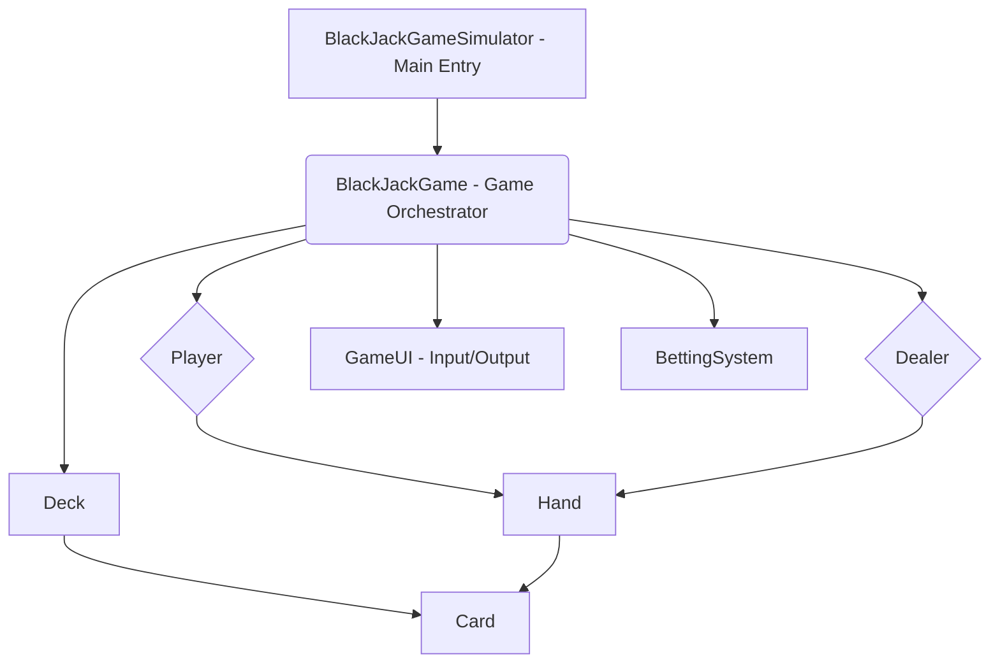

# BlackJack Game

Command-line BlackJack Game with simulated dealer. This is a complete working Java command-line game that I created while tutoring someone else in Java for their accelerated bootcamp. The game seems simple by description, but the code is fairly long and complex for such a simple-sounding game.

Some interesting features I added were time-delays to make the game feel like an old-school Gameboy Color game. Gameboy games always have delays in their text printouts to make the games feel more suspenseful and realistic.

It seems I have lost the PDF that described what the instructor wanted the program to behave like, so here's an informal description:

The game of Black Jack is also called "Black Jack 21" or "21". Two players (a player and dealer) deal cards until they either add up to 21 or a lower number, or they automatically lose, if it's more than 21. They are dealt a hand of 2 cards. Dealer's second card is hidden from view. The Player can "hit" to pull cards, and he tries to get as close to 21 as possible without going over. When he decides to stop pulling cards, the dealer reveals his card, and pulls cards if his cards don't add up to 14 at the very least. After he exceeds that point, he stops drawing cards, and they compare their totals. Whoever has the higher amount wins.

Cards have values corresponding to their card number, and the following rules apply: Face cards (Jack, Queen, King) - 10 each (some BlackJack variants allow them to be 1, 2 or 3, but that is nonstandard) Ace - 11 (default) or 1 (if desired, or if 11 would cause you to bust).

The game also gives the non-dealer player an amount of money at the start to place his bets, and if he wins a round, he wins back his bet + that same amount.

## How to Run

To run this game locally:

1. Clone the repository: `git clone [repository_url]`
2. Install the Java SDK: Eclipse Adoptium (open source, general purpose): <https://adoptium.net/temurin/releases/>. Be sure to include the JDK's path in your PATH variable.
3. **Navigate to the project directory:** Open your terminal or command prompt and change your directory to the `BlackJackGame` folder:

   ```sh
   # example
   cd z:/code/amdphreak/BlackJackGame
   ```

4. **Compile the Java source files:**

   ```sh
   javac -d bin src/BlackJackGame/*.java src/module-info.java
   ```

5. **Run the game:**

   ```sh
   java --module-path bin -m BlackJackGame/BlackJackGame.BlackJackGameSimulator
   ```

## Changelog

### 2025/08/11

**Bug Fixes:**

- **Ace Value Calculation:** Corrected an issue in `Hand.java` where the game was not correctly re-valuing Ace cards from 11 to 1 when a player's hand exceeded 21. This fix ensures proper game logic and allows tie conditions to be correctly recognized.
- **String Comparison:** Updated string comparison for "Ace" in `BlackJackGameSimulator.java` from `==` to `.equals()` for improved code robustness and adherence to Java best practices.
- **IOException Handling:** Added `import java.io.IOException;` and updated the `main` and `placeBet` method signatures in `BlackJackGameSimulator.java` to `throws InterruptedException, IOException` to correctly handle potential `IOException`s during input operations.

**Improvements:**

- **Improved Command-Line Dialogues:** Updated various prompts and messages throughout the game to be more clear and friendly for first-time Blackjack players, including explanations of game rules, betting instructions, and player actions ("Hit" or "Stay").

**Refactoring:**

The project has undergone significant refactoring to improve its structure, maintainability, and extensibility. Key changes include:

- **Modular Design:** The monolithic `BlackJackGameSimulator` class has been broken down into several smaller, more focused classes, each with a single responsibility.
- **New Classes Introduced:**
  - `BlackJackGame`: Manages the overall game flow, rounds, and state.
  - `Player`: Encapsulates player-specific logic (hand, money, actions).
  - `Dealer`: Encapsulates dealer-specific logic (hand, drawing rules).
  - `GameUI`: Handles all command-line input and output, centralizing UI interactions.
  - `BettingSystem`: Manages all betting logic and money transactions.
- **Improved Separation of Concerns:** Game logic, player/dealer actions, UI, and betting are now distinct, making the codebase easier to understand, debug, and modify.
- **Reduced Coupling:** Components are less dependent on each other, allowing for changes in one area without widespread impact.


